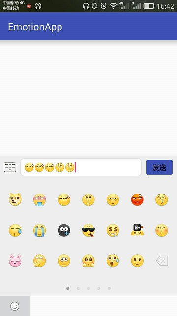
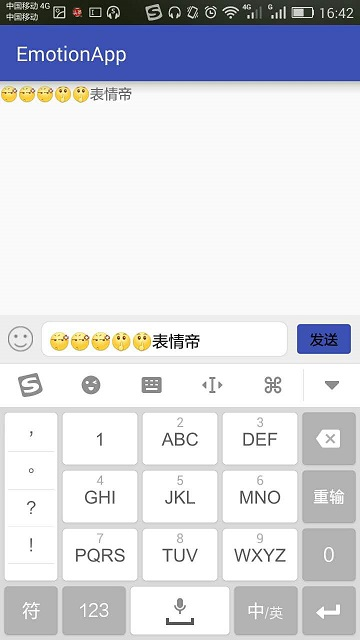
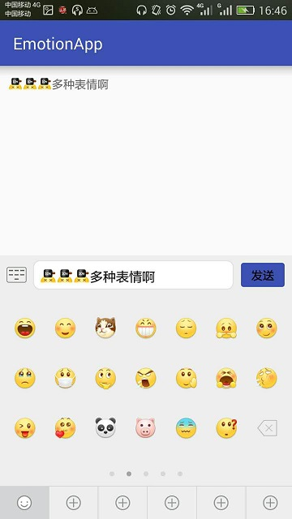

# EmotionApp
Android表情软键盘切换





----
## 在你的项目中
* 更换mipmap下的表情图
* 在utils/EmotionUtils下更换对应的规则
* 如果项目中需要多套表情，参考EmotionMainFragment类中的initData()方法和replaceFragment()方法，只需要一套注释replaceFragment()即可
* 点击发送按钮获取表情+文字内容并做转换处理
```
((TextView) contentView).setText(SpanStringUtils.getEmotionContent(EmotionUtils.EMOTION_CLASSIC_TYPE,
                        getActivity(), ((TextView) contentView), mEdtContent.getText().toString()));
                mEdtContent.setText("");
```
参数说明：
1、表情的类型；2、上下文；3、控件；4、EditText中的内容；

----
*参考：[emotionkeyboard]

[emotionkeyboard]:https://github.com/shinezejian/emotionkeyboard